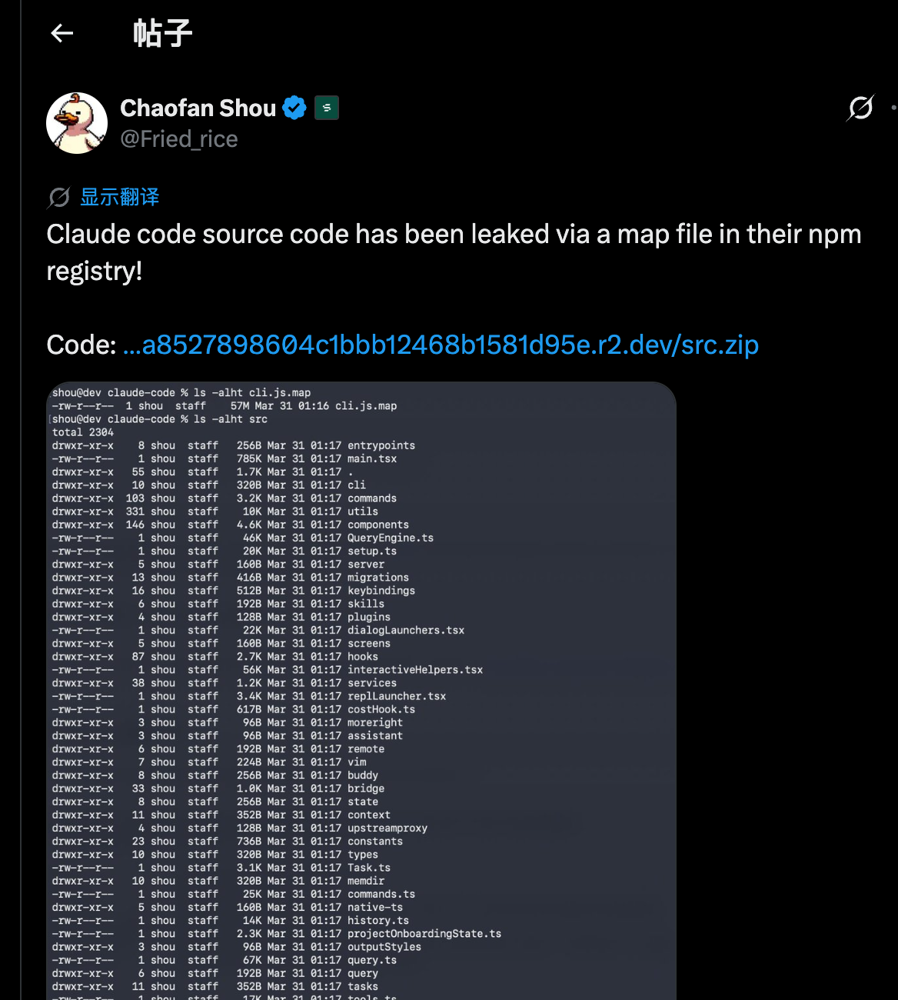
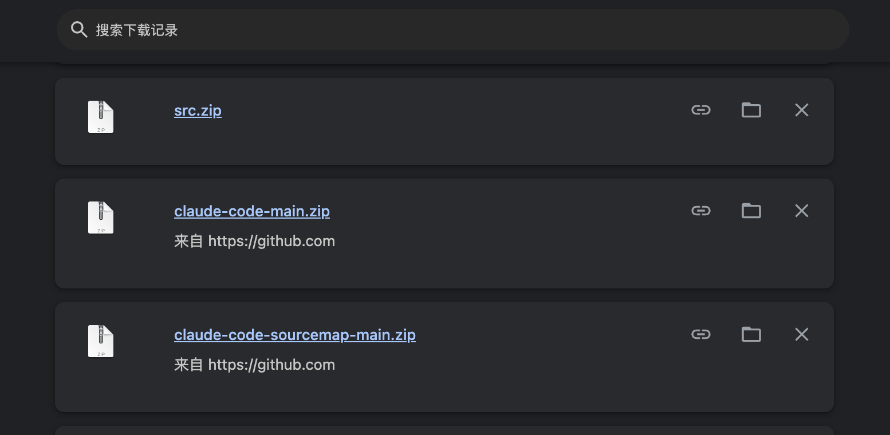

# 1. 安装 Bun（构建工具）
curl -LO https://github.com/oven-sh/bun/releases/latest/download/bun-darwin-aarch64.zip
unzip bun-darwin-aarch64.zip -d /tmp/bun && sudo cp /tmp/bun/bun-darwin-aarch64/bun /usr/local/bin/bun

# 2. 安装/更新依赖（可选，node_modules 已包含在仓库中）
pnpm install --registry https://registry.npmjs.org

# 3. 构建
bun run build.ts

# 4. 运行
bun dist/cli.js --version

广告位哈哈哈
---

https://github.com/andforce/Andclaw

https://github.com/andforce/octrix

